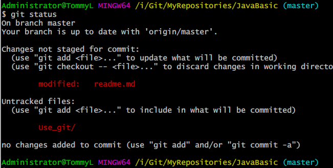
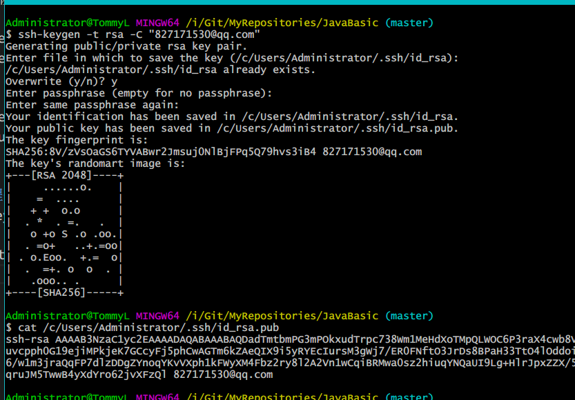

<!-- TOC -->

- [Git的使用](#git的使用)
    - [常用命令](#常用命令)
    - [GitHub远程仓库](#github远程仓库)

<!-- /TOC -->
# Git的使用
## 常用命令
1. 创建仓库  
```
/*
先在本地某一个位置创建一个文件夹作为你的仓库目录
然后进入该目录，使用init命令即可完成创建
*/
$ mkdir gitfolder   
$ cd gitfolder
$ git init
```
2. 添加命令
```
$ git add filename //添加指定文件
$ git config/*     //config 目录下及子目录下所有文件
$ git home/*.php   //home 目录下的所有.php 文件
$ git add 文件夹名
$ git add --all    //添加所有文件
```
3. 提交命令
```
$ git commit -m "add new file"
```
4. 查看状态
```
$ git status
```
<div align="center">

</div>  
 
5. 查看修改
```
$git diff filename
```

6. 查看日志
```
$ git log
```
7. 回退  
 Git 在内部有个指向当前版本的 HEAD 指针
```
$ git reset --hard 1094a
$ git reset --hard HEAD^
```
8. 查看命令历史
```
$ git reflog
```
9. 删除文件、恢复文件
```
$ rm filename
$ git rm filename
$ git commit -m "commit后从仓库中完成删除"

$ rm filename
$ git checkout -- filename //从版本库中恢复
```

## GitHub远程仓库
1. 生成SSH key
```
ssh-keygen -t rsa -C "youremail@example.com"
```
<div align="center">

</div>  
然后将那一串key添加到GitHub账户的ssh key中

2. 添加远程仓库
```
$ git remote add origin git@github.com:accountname/project.git
```
把本地仓库和远程仓库进行关联
*这里遇到的问题：'fatal:remote origin already exists'*  
*解决方法：*
```
$ git remote rm origin
$ git remote add origin git@github.com:accountname/project.git
```

3. 推送
```
$ git push -u origin master
```


4. fetch/merge
```
error: failed to push some refs to 'https://github.com/GDDXZ/RobotDenso.git'
hint: Updates were rejected because the remote contains work that you do
hint: not have locally. This is usually caused by another repository pushing
hint: to the same ref. You may want to first integrate the remote changes
hint: (e.g., 'git pull ...') before pushing again.
hint: See the 'Note about fast-forwards' in 'git push --help' for details.
```
解决方法：  
- 强制推送
```
$ git push -f
```
可以提交，会将 remote 上第一个人的改动冲掉，比较暴力，不太好。

- 正常解决
```
git fetch origin
git merge origin/master 
```
和本地分支合并，之后再 push。  

***未完待续...***