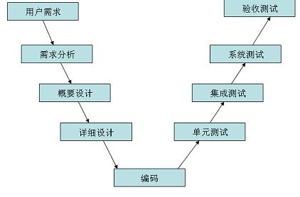
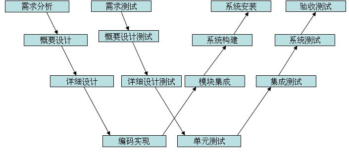
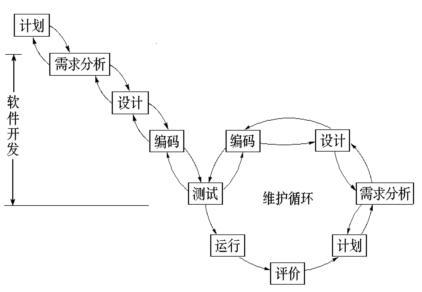

<!-- TOC -->

- [软件测试基础](#软件测试基础)
    - [软件测试的目的是什么](#软件测试的目的是什么)
    - [软件测试一般流程](#软件测试一般流程)
    - [常见的测试类型有哪些？分别说明一下？](#常见的测试类型有哪些分别说明一下)
    - [测试用例设计常用方法](#测试用例设计常用方法)
    - [一条高质量的缺陷记录应该是什么样的](#一条高质量的缺陷记录应该是什么样的)
    - [alpha测试和beta测试](#alpha测试和beta测试)
    - [你认为做好软件测试应该具备哪些素质？](#你认为做好软件测试应该具备哪些素质)
    - [作为测试人员，在与开发人员沟通过程中，如何有效的提高沟通效率和效果？](#作为测试人员在与开发人员沟通过程中如何有效的提高沟通效率和效果)
    - [你觉得软件测试工程师在一个团队中，都需要做什么？有什么价值？](#你觉得软件测试工程师在一个团队中都需要做什么有什么价值)
    - [你对软件测试最大的兴趣是什么？](#你对软件测试最大的兴趣是什么)
    - [黑盒测试方法？](#黑盒测试方法)
    - [白盒和黑盒区别？](#白盒和黑盒区别)
    - [测试生命周期模型](#测试生命周期模型)
        - [V模型](#v模型)
        - [W模型](#w模型)
        - [瀑布模型](#瀑布模型)
- [测试用例--方法](#测试用例--方法)
    - [等价类划分](#等价类划分)
    - [边界值分析](#边界值分析)
    - [错误推测法、因果图法和判定表驱动法](#错误推测法因果图法和判定表驱动法)
- [测试用例--实例](#测试用例--实例)
    - [如何编写测试用例](#如何编写测试用例)
    - [实例：用户登录功能](#实例用户登录功能)
- [用过哪些抓包工具？描述一下具体的操作过程。](#用过哪些抓包工具描述一下具体的操作过程)
- [接触过性能测试吗？用过哪些工具？你是怎么使用工具进行性能测试的？](#接触过性能测试吗用过哪些工具你是怎么使用工具进行性能测试的)
- [接口测试](#接口测试)

<!-- /TOC -->
# 软件测试基础

## 软件测试的目的是什么
1. 为了发现程序中的缺陷，保证软件质量
2. 满足用户需要

## 软件测试一般流程
1. 项目立项后，参加需求评审 
2. 根据需求文档制定测试用例，然后进行用例评审 
3. 项目提测后，执行用例，问题记录 ，及时有效的跟进问题的解决情况 
4. 测试环境测试通过后，产品进行验收测试

## 常见的测试类型有哪些？分别说明一下？

1. 黑盒测试，即功能测试
2. 白盒测试，单元测试
3. 兼容性测试：浏览器兼容测试
4. 集成测试：各个模块的测试
5. 系统测试：各模块测试完成后，对整个系统的完整性测试
6. 回归测试
7. 验收测试

## 测试用例设计常用方法
1. 等价类划分：有效等价类，无效等价类。将测试的范围划分成几个互不相交的子集，从每个子集中选出若干代表性的值用作测试用例。
2. 边界值：==，>=....
3. 场景法：划分场景，逐一测试（业务）

## 一条高质量的缺陷记录应该是什么样的
1. 记录bug产生的前提条件
2. 产生bug的详细操作步骤
3. 截图

## alpha测试和beta测试
1. alpha测试：把用户请到开发方的场所来测试，用户在模拟实际操作环境下进行测试，由开发记录用户反馈的问题
2. beta测试：当开发和测试完成时进行。很多不同的用户，在不同的环境下操作，然后把用户把产生的问题定期发给开发者

## 你认为做好软件测试应该具备哪些素质？
1. 较好的技术能力 2. 对业务逻辑的理解 3. 良好的沟通能力 4. 解决和分析事情的能力

## 作为测试人员，在与开发人员沟通过程中，如何有效的提高沟通效率和效果？
1.耐心的跟开发沟通，跟他阐述不过的重要性 说服他解决问题 2. 充分尊重对方，哪怕再低级的 bug 都不要小看他 3. 宽以待人，设身处地为他人着想 即使开发因为压力或者其他原因不肯合作 也要心平气和的跟他沟通 讨论 bug 的优先级 4. 平时多跟开发沟通 无论是工作还是生活上的问题，但是测试一定要有自己的原则 对测试的产品质量负责 5. 自己先定位问题 帮助开发缩小排查范围

## 你觉得软件测试工程师在一个团队中，都需要做什么？有什么价值？
1.在产品需求会上 可以站在用户的角度 提一些贴合用户需求的建议 2. 测试阶段，根据自己对项目的了解和专业的测试技能 尽可能在项目上线前测出更多问题 保证产品质量 3. 对测试过程中出现的问题 合理有效的进行风险评估。 4. 对质量严格把关 测试不通过的 一定不能发布生产

## 你对软件测试最大的兴趣是什么？
1.行业前景比较好，而且近些年 越来越多企业更注重测试 2. 测试时间越久 面临的困难和挑战也越多，解决问题的同时 也提高了自身的能力 3. 自己的性格比较外向开朗 很容易跟产品和开发沟通 做起事情可以事半功倍

## 黑盒测试方法？
- UI 测试
- 数据和数据库完整性测试
- 易用性测试
- 功能测试
- 性能测试
- 自动化测试
- 健壮性测试 稳定性测试 场景测试 逻辑测试 随机测试 集成测试 系统测试 验收测试 冒烟测试 兼容性测试 逆向思维测试 本地化测试 接口测试 回归测试 Cookie 测试; Alpha测试 Beta测试 安全性和访问控制测试

## 白盒和黑盒区别？
白盒测试：是通过程序的源代码进行测试而不使用用户界面。

黑盒测试：是通过使用整个软件或某种软件功能来严格地测试。

- 测试特点不同

> 黑盒测试：测试功能。  
白盒测试：测试程序接口与结构

- 测试依据不同

>黑盒测试：需求规格说明书  
白盒测试：软件程序

- 侧重点不同

> 黑盒测试：关注功能逻辑实现  
白盒测试：关注内部代码结构

## 测试生命周期模型

### V模型

### W模型

### 瀑布模型

# 测试用例--方法

## 等价类划分
等价类划分，就是把程序的输入域划分为若干部分，从每个部分中选取少数、有代表性的数据作为程序输入的测试用例。每个部分的代表性数据在测试中的作用等价于这部分数据中其他数据
>https://mp.weixin.qq.com/s/JFy9RAYK4MwsJf9BsRZkzg

## 边界值分析
在长期的测试工作中，你会发现，大量的错误都是发生在输入或输出范围的边界上。

作为一种补充等价类划分的测试方法，边界值分析通常选择等价类边界设计测试用例。注意，边界值分析法不仅需要重视输入值的边界，对输出值的边界也需要同样重视。
>https://mp.weixin.qq.com/s/ghzkEsrH5AqvBnHvqS5slQ

## 错误推测法、因果图法和判定表驱动法

>https://mp.weixin.qq.com/s/JOS-3lf70M-G0yBa5hXO-g

- 错误推测法：一句话介绍，错误推测法就是依据个人经验，有针对性的设计测试用例的方法。
例如：
 
①输入一些非法、错误、不正确和垃圾输入；

②软件要求输入数字，就输入字母或汉字；

③软件要求输入正数，就输入负数；

④软件对时间敏感，就设置很早和很晚的时间，如公元200年；

⑤输入空格、输入为空等等。

- 因果图法：因果图法是从自然语言书写的程序规格说明的描述中找出输入条件和输入状态，通过因果图转为判定表，根据判定表的每一列设计测试用例。

具体步骤如下：

①分析程序需求规格说明书的描述，哪些是原因，哪些是结果，原因通常是输入条件，结果通常是输出条件；

②分析程序需求规格说明书的语义内容，将其表示成连接各个原因与各个结果的“因果图”；

③标明约束条件，由于语法或环境的限制，有些原因和结果的组合情况是不可能出现的。为表明这些特定的情况，在因果图上使用若干个标准的符号标明约束条件；

④把因果图转换成判定表；

⑤为判定表中每一列表示的情况设计测试用例。

- 判定表驱动法

# 测试用例--实例

## 如何编写测试用例

1. 测试用例编号

首先，应该要给每一条测试用例一个唯一的编号。这个编号有很多地方会用到，例如：测试记录、缺陷列表等。有了这个编号，后期查找记录就会方便的多。

2. 测试项目

一般，我们测试都会有很多级菜单，所以，最好在每条测试用例的前面，加上对应的菜单项。即使有非常多页的测试用例，也能一眼看清楚该条测试用例到底对应哪个功能。

3. 前置条件

也就是发生该条测试用例的前提。例如：对登录界面进行测试，那么前置条件应该就是“存在可以登录的用户名和密码”；对列表进行修改、删除等操作，那么前置条件应该是“存在可以进行修改、删除的记录’”。

4. 操作步骤

用来记录该条测试记录的具体操作步骤，最好分1,2,3来记录，这样能否方便bug的复现，记录的越详细，bug复现操作起来就越容易，也方便同事之间的工作交接。

5. 预期结果

根据系统需求规格说明书来编写，我们验证系统是否正确，大多是依据用户的需求来确定，用户的需求就体现在需求规格说明书中，所以，对预期结果的编写，要依据需求规则说明书来。

6. 实测结果

用来记录该条测试结果是否通过。如果记录为通过，该条测试记录就结束；如果记录为不通过，需要去缺陷列表记录下测试不通过的具体情况。

7. 复测结果

可以记录第二名测试人员的测试记录，能够进一步确认系统功能是否通过。

## 实例：用户登录功能

最常见的是等价类划分和边界值分析，那么，基于这两种测试方法，我们常设计如下这些测试用例：

1. 输入正确的，已存在的用户名和密码，点击【登录】按钮；
2. 输入已存在的正确的用户名，错误的密码，点击【登录】按钮；
3. 输入不存在的用户名，任意密码，点击【登录】按钮；
4. 用户名为空，输入任意密码，点击【登录】按钮；
5. 输入正确的、已存在的用户名，密码为空，点击【登录】按钮；
6. 用户名、密码都为空，点击【登录】按钮；
7. 如果存在验证码，输入正确的、已存在的用户名和密码，输入正确的验证码，点击【登录】按钮；
8. 如果存在验证码，输入正确的、已存在的用户名和密码，输入错误的验证码，点击【登录】按钮。

**如果是一个有经验的测试工程师，除了设计上面的测试用例，她还会考虑到下面这些情况：**

1. 用户名、密码是否支持特殊字符、汉字；
2. 用户名、密码对长度有没有限制，如需要控制在4-12位；
3. 用户名、密码对大小写字母是否敏感；
4. 输入密码时，密码框是否加密显示；
5. 忘记密码的功能是否正常；
6. 刷新页面，验证码是否会刷新；
7. 点击验证码，验证码是否会刷新；
8. 刷新后的验证码，是否能正常使用；
9. 系统创建的用户，第一次登录时，是否会提示修改密码；
10. 如果是短信验证码登录，需要对时效内的验证码和时效外的验证码分别进行验证；
11. 如果系统安全性较强，需要测试超过一定时间不操作是否会强制退出登录；
12. 登录成功后，但是会话超时，需要验证继续操作是否会重定向到用户登录界面；
13. 用户有权限区别的情况下，需要验证不同权限的用户登录系统后权限是否正确；
14. 打开登录界面，需要验证默认焦点是否在用户名输入框中；
15. 页面操作时，需要验证快捷键Tab和Enter键，是否可以使用。

在这个国家标准5.3中，将软件产品质量属性划分为8个特性，依次为：
功能性、性能效率、兼容性、易用性、可靠性、信息安全性、维护性、可移植性

上面介绍的测试用例，都是基于功能性这个质量特性来设计的，关注点都在软件功能是否实现了没有。那针对软件测试，除了功能性，还有后面7个质量特性呢，所以，上面介绍的测试用例，还是不够全面的。

对性能效率相关的测试用例，可以设计如下：

1. 单用户登录的平均响应时间是否小于3秒；
2. 单用户登录持续运行5分钟，看服务器请求数量是否超出正常数值；
3. 根据系统用户量，设计高并发进行登录，看系统的平均响应时间是否小于3秒；
4. 针对高并发情况下，看服务器的各种指标是否在预期内；
5. 针对高并发，设置集合点的情况下，是否存在不合理的资源等待。

对兼容性相关的测试用例，可以设计如下：

1. 验证不同浏览器下，用户登录页面显示是否正常；
2. 验证不同浏览器下，用户登录功能是否正常；
3. 验证同一个浏览器，不同版本下，用户登录页面显示是否正常；
4. 验证同一个浏览器，不同版本下，用户登录功能是否正常；
5. 验证不同的移动设备（手机、iPad，根据实际情况选择不同机型）下，用户登录页面显示是否正常；
6. 验证不同的移动设备（手机、iPad，根据实际情况选择不同机型）下，用户登录功能是否正常；
7. 验证不同系统（win7、win10、linux等）下，用户登录页面显示是否正常；
8. 验证不同系统（win7、win10、linux等）下，用户登录功能是否正常；
9. 验证不同分辨率下，用户登录页面显示是否正常；
10. 验证不同分辨率下，用户登录功能是否正常。

对易用性相关的测试用例，可以设计如下：

1. 用户登录界面中的文字、颜色等信息是否与功能一致；
2. 用户登录界面中前景色与背景色搭配是否合理协调，反差是否过大；
3. 用户登录界面中的元素大小和布局是否协调；
4. 用户登录窗口的比例是否合适；
5. 用户登录界面中的图标是否符合常规的表达习惯。

对可靠性相关的测试用例，可以设计如下：

1. 输入已存在的用户名、错误的密码，查看系统对误操作的提示是否正确；
2. 用户名、密码输入为空，点击【登录】按钮，查看系统对误操作的提示是否正确；
3. 在测试用户登录时，查看有无操作引起的系统异常退出的情况；
4. 对用户名、密码进行字符类型规定时，查看系统是否对输入的数据进行有效性校验，保证数据的可靠性；
5. 如果因网络、硬件故障，进行操作时，系统是否会给出相关反馈，能否影响到系统内部的数据。

对信息安全性相关的测试用例，可以设计如下：

1. 用户名、密码在后台存储是否加密；
2. 用户名、密码在网络传输过程中是否加密；
3. 密码是否存在有效期，到期后，系统是否会提示修改密码；
4. 密码输入框是否不支持复制粘贴功能，包括快捷键（Ctrl+C，Ctrl+V）；
5. 输入密码后，在页面源码模式下是否不能被查看；
6. 输入的错误密码次数达到规定数量后，系统是否会禁用这个用户；
7. 禁用用户后，在规定的时间间隔能否自动恢复；
8、在用户名、密码输入框中输入典型的SQL注入字符串，如： 'or 1=1#，查看系统的返回界面；
9. 在用户名、密码输入框中输入典型的XSS跨站脚本攻击字符串，如：alert（‘XSS’），查看系统行为是否被修改；
10. 同一个用户，在同一个设备上不同的浏览器进行登录，查看互斥性是否符合预期；
11. 同一个用户，在多个设备上进行登录，查看互斥性是否符合预期；
12. 查看系统安全日志，是否包括登录用户名称、登录时间、浏览动作、修改动作、删除动作、退出时间、登录机器IP等。

对维护性相关的测试用例，可以设计如下：

1. 系统升级或更新后，对用户登录功能的使用是否正常。

对可移植性相关的测试用例，可以设计如下：

1. 系统从一种硬件设备、或正在运行的环境迁移到另一种环境后，迁移效率是否较高，用户登录功能的使用是否正常。

# 用过哪些抓包工具？描述一下具体的操作过程。

1. 常见的抓包工具有：wireshark、sniffer、httpwatch、fiddler 等。
2. 我常用的抓包工具是 wireshark，具体操作过程如下：打开软件，点击设置按钮，在弹出的设置选项对话框中，选择需要监听的接口，设置混杂模式；设置捕获过滤条件，如只捕获 http 相关的数据包，就可以设置捕获条件为 port 80，因为 http 使用的端口是 80 端口；设置完成后，点击 start 按钮，开始捕获数据，结束后，点击 save 按钮保存数据；捕获数据后，可以通过显示过滤器来筛选你想要查看的数据包。

# 接触过性能测试吗？用过哪些工具？你是怎么使用工具进行性能测试的？

1. 接触过性能测试，用过 JMeter 和 loadrunner。
2. 以 loadrunner 为例，介绍进行性能测试的流程：loadrunner 安装完成后，有 3 个应用程序，分别是 Virtual User Generator、Controller、Analysis。用 vugen 录制脚本，新建一个脚本，选择对应的协议、输入需要录制的网址，开始录制。录制结束后，根据需要进行脚本的修改，如设置集合点、设置关联等，修改完成后回放脚本，查看修改是否正常。脚本调试完毕后，把脚本添加到 Controller 中，根据需要设置运行模式，设置并发数量等，进行性能测试。执行性能测试过程中，观察响应时间等参数以及执行过程中是否有报错的现象，如果有报错，根据错误查询对应的解决办法，直到测试完全通过。测试通过后，保存测试结果，用 Analysis 打开，进行本次性能测试结果的分析。

# 接口测试
Jmeter