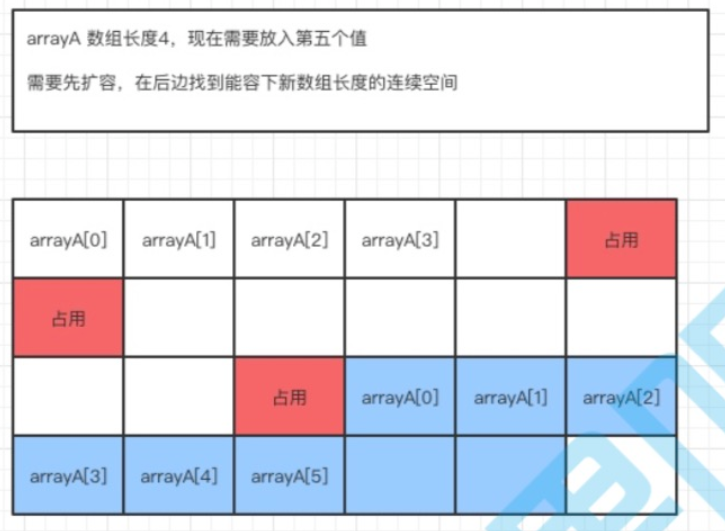
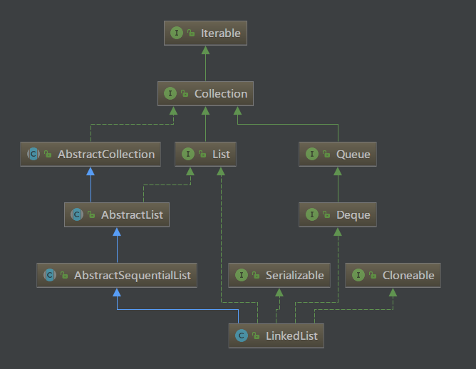
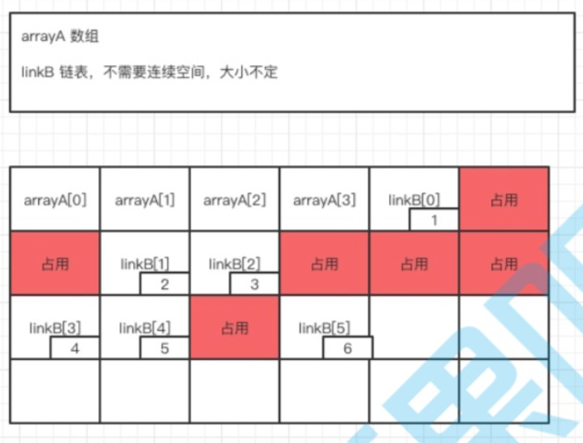

<!-- TOC -->

- [List<T> list=new ArrayList<>()引发的思考](#listt-listnew-arraylist引发的思考)
    - [多态的概念](#多态的概念)
        - [向上转型](#向上转型)
        - [向下转型](#向下转型)
    - [接口编程](#接口编程)
        - [什么是面向接口编程](#什么是面向接口编程)
        - [为什么要面向接口编程](#为什么要面向接口编程)
        - [封闭 - 开放原则](#封闭---开放原则)
- [Java集合](#java集合)
    - [List、Set、Map三者的区别](#listsetmap三者的区别)
    - [ArrayList 和 LinkedList](#arraylist-和-linkedlist)
        - [ArrayList](#arraylist)
        - [LinkedList](#linkedlist)
        - [二者的区别](#二者的区别)
        - [ArrayList扩容机制](#arraylist扩容机制)
    - [HashMap](#hashmap)
        - [什么是HashMap](#什么是hashmap)
        - [存储结构](#存储结构)
            - [Hash冲突](#hash冲突)
            - [构造函数](#构造函数)
        - [功能实现](#功能实现)
            - [确定索引位置](#确定索引位置)
                - [为何 HashMap 的数组长度一定是 2 的次幂](#为何-hashmap-的数组长度一定是-2-的次幂)
            - [put方法](#put方法)
            - [扩容resize()](#扩容resize)
        - [线程安全性](#线程安全性)
    - [HashMap,HashTable](#hashmaphashtable)
    - [HashMap HashSet](#hashmap-hashset)

<!-- /TOC -->

# List<T> list=new ArrayList<>()引发的思考

## 多态的概念

多态--就是指程序中定义的引用变量所指向的具体类型和通过该引用变量发出的方法调用在编程时并不确定，而是在程序运行期间才确定，即一个引用变量倒底会指向哪个类的实例对象，该引用变量发出的方法调用到底是哪个类中实现的方法，必须在由程序运行期间才能决定。因为在程序运行时才确定具体的类，这样，不用修改源程序代码，就可以让引用变量绑定到各种不同的类实现上，从而导致该引用调用的具体方法随之改变，即不修改程序代码就可以改变程序运行时所绑定的具体代码，让程序可以选择多个运行状态，这就是多态性。

比如，比如你是一个酒神，对酒情有独钟。某日回家发现桌上有几个杯子里面都装了白酒，从外面看我们是不可能知道这是些什么酒，只有喝了之后才能够猜出来是何种酒。你一喝，这是剑南春、再喝这是五粮液、再喝这是酒鬼酒…. 在这里我们可以描述成如下：

      酒 a = 剑南春

      酒 b = 五粮液

      酒 c = 酒鬼酒

这里所表现的的就是多态。剑南春、五粮液、酒鬼酒都是酒的子类，我们只是通过酒这一个父类就能够引用不同的子类，这就是多态 —— 我们只有在运行的时候才会知道引用变量所指向的具体实例对象。

### 向上转型

在之前的例子中，通过`Wine a=new JNC();`在这里我们这样理解，这里定义了一个 Wine 类型的 a，它指向 JNC 对象实例。由于 JNC 是继承与 Wine，所以 JNC 可以自动向上转型为 Wine，所以 a 是可以指向 JNC 实例对象的。
```
public class Wine {
    public void fun1(){
        System.out.println("Wine 的Fun.....");
        fun2();
    }
    
    public void fun2(){
        System.out.println("Wine 的Fun2...");
    }
}

public class JNC extends Wine{
    /**
     * @desc 子类重载父类方法
     *        父类中不存在该方法，向上转型后，父类是不能引用该方法的
     * @param a
     * @return void
     */
    public void fun1(String a){
        System.out.println("JNC 的 Fun1...");
        fun2();
    }
    
    /**
     * 子类重写父类方法
     * 指向子类的父类引用调用fun2时，必定是调用该方法
     */
    public void fun2(){
        System.out.println("JNC 的Fun2...");
    }
}

public class Test {
    public static void main(String[] args) {
        Wine a = new JNC();
        a.fun1();
    }
}
-------------------------------------------------
Output:
Wine 的Fun.....
JNC 的Fun2...
```
指向子类的父类引用由于向上转型了，它只能访问父类中拥有的方法和属性，而对于 ***子类中存在而父类中不存在的方法(子类单独定义的方法会丢失)*** `fun1(String a)`，该引用是不能使用的，尽管是重载该方法。若子类重写了父类中的某些方法，在调用该些方法的时候，必定是使用 ***子类中定义***的这些方法（动态连接、动态调用）。

### 向下转型

与之相对应的就是向下转型。向下转型是把父类对象转为子类对象。但这里有个要注意的地方。
```
Animal a = new Cat();
Cat c = ((Cat) a);
c.eat();
//输出  我吃鱼
Dog d = ((Dog) a);
d.eat();
// 报错 ： java.lang.ClassCastException：com.chengfan.animal.Cat cannot be cast to com.chengfan.animal.Dog
Animal a1 = new Animal();
Cat c1 = ((Cat) a1);
c1.eat();
// 报错 ： java.lang.ClassCastException：com.chengfan.animal.Animal cannot be cast to com.chengfan.animal.Cat
```
因为 a 本身就是 Cat 对象，所以它理所当然的可以向下转型为 Cat，也理所当然的不能转为 Dog，你见过一条狗突然就变成一只猫这种操蛋现象？

而 a1 为 Animal 对象，它也不能被向下转型为任何子类对象。比如你去考古，发现了一个新生物，知道它是一种动物，但是你不能直接说，啊，它是猫，或者说它是狗。

***向下转型注意事项***

1. 向下转型的前提是父类对象指向的是子类对象（也就是说，在向下转型之前，它得先向上转型）
2. 向下转型只能转型为本类对象（猫是不能变成狗的）。

***
对于面向对象而言，多态分为编译时多态和运行时多态。其中编译时多态是静态的，主要是指方法的重载，它是根据参数列表的不同来区分不同的函数，通过编辑之后会变成两个不同的函数，在运行时谈不上多态。而运行时多态是动态的，它是通过动态绑定来实现的，也就是我们所说的多态性。

***在Java中，实现多态有两种方式，继承和接口。***


<div align="center">

</div>  

从图中可以看出，`ArrayList` 继承了`AbstractList`类，同时也实现了`List`接口。

在语句`List<T> list=new ArrayList<>();`中，`list`此时就是`List`这个接口的实例化对象了，它可以使用`List`接口中的方法。`ArrayList`独有的就不能用了，比如`arraylist.trimToSize()`方法就不能用。


那为什么一般都使用 `List list = new ArrayList ()` , 而不用 `ArrayList alist = new ArrayList ()` 呢?

问题就在于 `List` 有多个实现类，如 `LinkedList` 或者 `Vector` 等等，现在你用的是 ArrayList，也许哪一天你需要换成其它的实现类呢？，这时你只要改变这一行就行了：`List list = new LinkedList ()`; 其它使用了 `list` 地方的代码根本不需要改动。

假设你开始用 `ArrayList alist = new ArrayList ()`, 这下你有的改了，特别是如果你使用了 `ArrayList` 特有的方法和属性.如果没有特别需求的话，最好使用 `List list = new LinkedList ()`; , 便于程序代码的重构. 这就是面向接口编程的好处。

## 接口编程

我们经常会说面向对象编程，然后又提倡面向接口编程。其实不管是面向对象还是面向接口，本质上是一种程序实现的思想。面向对象编程有三大特性：封装、继承、多态。而接口编程就重复利用了这些特性。

### 什么是面向接口编程

>在一个面向对象的系统中，系统的各种功能是由许许多多的不同对象协作完成的。在这种情况下，各个对象内部是如何实现自己的，对系统设计人员来讲就不那么重要了；而各个对象之间的协作关系则成为系统设计的关键。小到不同类之间的通信，大到各模块之间的交互，在系统设计之初都是要着重考虑的，这也是系统设计的主要工作内容。面向接口编程就是指按照这种思想来编程。--百度

简单说就是尽量在类中做到只写接口或抽象类的名字，而不是具体某一个类的名字。

### 为什么要面向接口编程

1. 实现多态.
2. 减少耦合性.
3. 令各个成员依赖于抽象，而不是依赖于具体.
4. 方便维护和扩展.

其中最主要的就是第四点，便于维护和扩展。也是常说的 ***封闭 - 开放原则***

### 封闭 - 开放原则

所谓封闭开放原则就是：对修改封闭，对扩展开放。

当你写代码写到一半 (或者已经 release), 你的产品经理让你增加点或者修改某些东西。看起来只需要修改一点点东西，实际上如果类设计不好的话，可能会牵一发动全身。就是所谓的维护成本很大.其实根本的解决方法就是一开始，合理的设计类，应用合理的设计模式.

尽量做到，一旦有增加或者修改需求，我们都无需修改以前的类 (对修改封闭)，而只需增加 1 个新的类 (通常是子类，对扩展开放)

举个例子：

现在要实现一个投资者类，他可以买股票。
```
public class Invester{  
    public void buyStock(Stock s,int amount){  
        .....  
        s.buy(amount);  
        .....  
    }  
}  


public class Stock(){  
    public void buy(int amount){};  

 }  
```

然后过两天，需求改动，说还要能买基金`fund`。如果不使用接口，那就要新增一个基金类，在`Invester`里添加`buyfund()`方法。如果只是一个两个那倒也无所谓，可是如果要你增加期货，债券一大堆乱七八糟的，那这个`Invester`类里面就会很臃肿，也不符合 *对修改封闭* 原则。

那如何优化呢？这就可以用到接口了。

我们创建一个理财产品接口，然后让股票，期货，基金这些来实现这个接口。然后对于`Invester`来说，`buy`方法里只要满足这个接口就可以。
```
public class Invester{  
    public void buyInvest(Investable i,int amount){  
        .....  
        i.buy(amount);  
        .....  
    }  
}  


public class Stock() implements Investable{  
    @Override  
    public void buy(int amount){};  
}  

public interface Investable{  
    void buy(int amount);  
}  
```

最后分享一篇文章，里面就把接口编程说的很通俗易懂。

[为什么我们要面向接口编程？！](http://www.imooc.com/article/301555)


***
# Java集合


- Map 集合：是一种键和值的映射关系 (双列集合)。常用的有`HashMap`        
- Collection 集合：单列集合，只能存储一种类型的元素。提供具体的子接口`List`,`Set`,`Queue`.常用的有`ArrayList`,`LinkedList`,`HashSet`

## List、Set、Map三者的区别
- **List** : List接口存储一组不唯一（可以有多个元素引用相同的对象）**有序** 的对象。
- **Set** : 不允许重复的集合。不会有多个元素引用相同的对象。
- **Map** : 使用键值对存储。Map会维护与Key有关联的值。两个Key可以引用相同的对象，但Key不能重复，典型的Key是String类型，但也可以是任何对象。

## ArrayList 和 LinkedList

### ArrayList


ArrayList: 可以看作是能够自动增长容量的数组。  
ArrayList的toArray 方法返回一个数组。  
ArrayList 的 asList 方法返回一个列表。  
ArrayList 底层的实现是 Array，`Object`数组。

- ArrayList扩容



>新增数据空间判断  
>新增数据的时候需要判断当前是否有空闲空间存储  
>扩容需要申请新的连续空间  
>把老的数组复制过去  
>新加的内容  
>回收老的数组空间
- ArrayList 在初始化的时候指定长度肯定是要比不指定长度的性能好很多，这样不用重复的申请空间，复制数组，销毁老的分配空间了

### LinkedList



`LinkedList` 是一个双链表，在添加和删除元素时具有比 ArrayList 更好的性能。但在 get 与 set 方面弱于 ArrayList. 当然，这些对比都是指数据量很大或者操作很频繁。



### 二者的区别

1. **是否保证线程安全** ：`ArrayList`,`LinkedList`都是不同步的，也就是不保证线程安全性。
2. **底层数据结构**： `ArrayList`底层使用`Object`数组；`LinkedList`底层使用的是**双向链表**
3. **插入和删除是否受元素位置影响** ：   
   - `ArrayList`采用数组存储，所以插入和删除元素的时间复杂度受位置影响。比如：执行 `add(E e)`方法的时候，`ArrayList` 会默认在将指定元素追加到列表的末尾，这时候是`O(1)`。但如果在指定位置 `i` 插入就是`O(n-i)`
   - `LinkedList` 采用链表存储，所以对于`add(E e)`方法，复杂度是`O(1)`，如果要求指定位置，则为`O(n)`

4. **是否支持快速随机访问：** 通过索引快速获取`get(int index)` 。`LinkedList`不支持，`ArrayLits`支持。
5. **内存空间占用：** `ArrayList`的空间浪费主要体现在在list列表末尾会预留一定的容量空间。而`LinkedList`则体现在每一个元素消耗的空间比`ArrayList`多。

### ArrayList扩容机制
。。。

## HashMap

HashMap 是 Java 程序员使用频率最高的用于映射 (键值对) 处理的数据类型。JDK1.8 对 HashMap 底层的实现进行了优化，例如引入红黑树的数据结构和扩容的优化等。这里对HashMap的相关知识点进行一个梳理。（这里的内容参考于https://zhuanlan.zhihu.com/p/21673805）

### 什么是HashMap

Java 为数据结构中的映射定义了一个接口 java.util.Map，此接口主要有四个常用的实现类，分别是 HashMap、Hashtable、LinkedHashMap 和 TreeMap，类继承关系如下图所示：


HashMap：它根据键的 hashCode 值存储数据，大多数情况下可以直接定位到它的值，因而具有很快的访问速度，但遍历顺序却是不确定的。 HashMap 最多只允许一条记录的键为 null，允许多条记录的值为 null。HashMap 非线程安全，即任一时刻可以有多个线程同时写 HashMap，可能会导致数据的不一致。如果需要满足线程安全，可以用 Collections 的 `synchronizedMap` 方法使 HashMap 具有线程安全的能力，或者使用 `ConcurrentHashMap`。

### 存储结构

从结构实现来讲，HashMap 是数组 + 链表 + 红黑树（JDK1.8 增加了红黑树部分）实现的，如下如所示。


1. 从源码可知，HashMap 类中有一个非常重要的字段，就是 `Node [] table`，即哈希桶数组，明显它是一个 Node 的数组。
```
static class Node<K,V> implements Map.Entry<K,V> {
        final int hash;    //用来定位数组索引位置
        final K key;
        V value;
        Node<K,V> next;   //链表的下一个node

        Node(int hash, K key, V value, Node<K,V> next) { ... }
        public final K getKey(){ ... }
        public final V getValue() { ... }
        public final String toString() { ... }
        public final int hashCode() { ... }
        public final V setValue(V newValue) { ... }
        public final boolean equals(Object o) { ... }
}
```

Node 是 HashMap 的一个内部类，实现了 Map.Entry 接口，本质是就是一个映射 (键值对)

2. HashMap 就是使用哈希表来存储的。哈希表为解决冲突，可以采用开放地址法和链地址法等来解决问题，Java 中 HashMap 采用了链地址法。链地址法，简单来说，就是数组加链表的结合。在每个数组元素上都一个链表结构，当数据被 Hash 后，得到数组下标，把数据放在对应下标元素的链表上。

#### Hash冲突

在执行`map.put("白酒","茅台")；`这条语句时，  
系统将调用 "白酒" 这个 key 的 `hashCode ()` 方法得到其 hashCode 值（该方法适用于每个 Java 对象），然后再通过 Hash 算法的后两步运算（高位运算和取模运算）来定位该键值对的存储位置，有时两个 key 会定位到相同的位置，表示发生了 Hash 碰撞。当然 Hash 算法计算结果越分散均匀，Hash 碰撞的概率就越小，map 的存取效率就会越高。

如果哈希桶数组很大，即使较差的 Hash 算法也会比较分散，如果哈希桶数组数组很小，即使好的 Hash 算法也会出现较多碰撞，所以就需要在空间成本和时间成本之间权衡，其实就是在根据实际情况确定哈希桶数组的大小，并在此基础上设计好的 hash 算法减少 Hash 碰撞。那么通过什么方式来控制 map 使得 Hash 碰撞的概率又小，哈希桶数组（Node [] table）占用空间又少呢？答案就是好的 Hash 算法和扩容机制。

#### 构造函数


在构造函数中，主要是对下面4个字段进行初始化。
```
 int threshold;             // 所能容纳的key-value对极限 
 final float loadFactor;    // 负载因子
 int modCount;              //
 int size;
```
`threshold = length * Load factor`  
`Node[] table`初始化长度 `length`默认为16，负载因子为0.75。
负载因子越大，容纳极限越大。如果超过极限，就要扩容`resize()`。扩容后空间是原来的两倍

### 功能实现

#### 确定索引位置

具体看源码:

```
static final int hash(Object key) {   //jdk1.8 & jdk1.7
     int h;
     // h = key.hashCode() 为第一步 取hashCode值
     // h ^ (h >>> 16)  为第二步 高位参与运算
     return (key == null) ? 0 : (h = key.hashCode()) ^ (h >>> 16);
}

static int indexFor(int h, int length) {  //jdk1.7的源码，jdk1.8没有这个方法，但是实现原理一样的
     return h & (length-1);  //第三步 取模运算
}  
```

Hash 算法本质上就是三步：**取 key 的 hashCode 值、高位运算、取模运算。**

##### 为何 HashMap 的数组长度一定是 2 的次幂

我们通过 `h & (table.length -1)` 来得到该对象的保存位，当 length 总是 2 的 n 次方时，`h& (length-1)` 运算等价于对 length 取模，也就是 `h% length`，但是 & 比 % 具有更高的效率。

还有，数组长度保持 2 的次幂，length-1 的低位都为 1，会使得获得的数组索引 index 更加均匀


我们看到，上面的 & 运算，高位是不会对结果产生影响的（hash 函数采用各种位运算可能也是为了使得低位更加散列），我们只关注低位 bit，如果低位全部为 1，那么对于 h 低位部分来说，任何一位的变化都会对结果产生影响，也就是说，要得到 index=21 这个存储位置，h 的低位只有这一种组合。这也是数组长度设计为必须为 2 的次幂的原因。


如果不是 2 的次幂，也就是低位不是全为 1 此时，要使得 index=21，h 的低位部分不再具有唯一性了，哈希冲突的几率会变的更大，同时，index 对应的这个 bit 位无论如何不会等于 1 了，而对应的那些数组位置也就被白白浪费了。

#### put方法


源码：
```
public V put(K key, V value) {
    return putVal(hash(key), key, value, false, true);
}
 
final V putVal(int hash, K key, V value, boolean onlyIfAbsent,
               boolean evict) {
    Node<K,V>[] tab; Node<K,V> p; int n, i;
    // 1.校验table是否为空或者length等于0，如果是则调用resize方法进行初始化
    if ((tab = table) == null || (n = tab.length) == 0)
        n = (tab = resize()).length;
    // 2.通过hash值计算索引位置，将该索引位置的头节点赋值给p，如果p为空则直接在该索引位置新增一个节点即可
    if ((p = tab[i = (n - 1) & hash]) == null)
        tab[i] = newNode(hash, key, value, null);
    else {
        // table表该索引位置不为空，则进行查找
        Node<K,V> e; K k;
        // 3.判断p节点的key和hash值是否跟传入的相等，如果相等, 则p节点即为要查找的目标节点，将p节点赋值给e节点
        if (p.hash == hash &&
            ((k = p.key) == key || (key != null && key.equals(k))))
            e = p;
        // 4.判断p节点是否为TreeNode, 如果是则调用红黑树的putTreeVal方法查找目标节点
        else if (p instanceof TreeNode)
            e = ((TreeNode<K,V>)p).putTreeVal(this, tab, hash, key, value);
        else {
            // 5.走到这代表p节点为普通链表节点，则调用普通的链表方法进行查找，使用binCount统计链表的节点数
            for (int binCount = 0; ; ++binCount) {
                // 6.如果p的next节点为空时，则代表找不到目标节点，则新增一个节点并插入链表尾部
                if ((e = p.next) == null) {
                    p.next = newNode(hash, key, value, null);
                    // 7.校验节点数是否超过8个，如果超过则调用treeifyBin方法将链表节点转为红黑树节点，
                    // 减一是因为循环是从p节点的下一个节点开始的
                    if (binCount >= TREEIFY_THRESHOLD - 1)
                        treeifyBin(tab, hash);
                    break;
                }
                // 8.如果e节点存在hash值和key值都与传入的相同，则e节点即为目标节点，跳出循环
                if (e.hash == hash &&
                    ((k = e.key) == key || (key != null && key.equals(k))))
                    break;
                p = e;  // 将p指向下一个节点
            }
        }
        // 9.如果e节点不为空，则代表目标节点存在，使用传入的value覆盖该节点的value，并返回oldValue
        if (e != null) {
            V oldValue = e.value;
            if (!onlyIfAbsent || oldValue == null)
                e.value = value;
            afterNodeAccess(e); // 用于LinkedHashMap
            return oldValue;
        }
    }
    ++modCount;
    // 10.如果插入节点后节点数超过阈值，则调用resize方法进行扩容
    if (++size > threshold)
        resize();
    afterNodeInsertion(evict);  // 用于LinkedHashMap
    return null;
}

```

#### 扩容resize()

源码如下（1.7）： 
```
void resize(int newCapacity) {   //传入新的容量
      Entry[] oldTable = table;    //引用扩容前的Entry数组
      int oldCapacity = oldTable.length;         
      if (oldCapacity == MAXIMUM_CAPACITY) {  //扩容前的数组大小如果已经达到最大(2^30)了
          threshold = Integer.MAX_VALUE; //修改阈值为int的最大值(2^31-1)，这样以后就不会扩容了
          return;
      }
   
      Entry[] newTable = new Entry[newCapacity];  //初始化一个新的Entry数组
     transfer(newTable);                         //！！将数据转移到新的Entry数组里
     table = newTable;                           //HashMap的table属性引用新的Entry数组
     threshold = (int)(newCapacity * loadFactor);//修改阈值
 }
```

这里就是使用一个容量更大的数组来代替已有的容量小的数组，transfer () 方法将原有 Entry 数组的元素拷贝到新的 Entry 数组里。

```
  void transfer(Entry[] newTable) {
      Entry[] src = table;                   //src引用了旧的Entry数组
      int newCapacity = newTable.length;
      for (int j = 0; j < src.length; j++) { //遍历旧的Entry数组
          Entry<K,V> e = src[j];             //取得旧Entry数组的每个元素
          if (e != null) {
              src[j] = null;//释放旧Entry数组的对象引用（for循环后，旧的Entry数组不再引用任何对象）
              do {
                 Entry<K,V> next = e.next;
                 int i = indexFor(e.hash, newCapacity); //！！重新计算每个元素在数组中的位置
                 e.next = newTable[i]; //链表的头接法
                 newTable[i] = e;      //将元素放在数组上
                 e = next;             //访问下一个Entry链上的元素
             } while (e != null);
         }
     }
 }
```

### 线程安全性

在多线程使用场景中，应该尽量避免使用线程不安全的 HashMap，而使用线程安全的 ConcurrentHashMap。那么为什么说 HashMap 是线程不安全的，下面举例子说明在并发的多线程使用场景中使用 HashMap 可能造成死循环。

## HashMap,HashTable

1. **线程是否安全：**  
HashMap 是非线程安全的，HashTable 是线程安全的；HashTable 内部的方法基本都经过 synchronized 修饰。（如果你要保证线程安全的话就使用 ConcurrentHashMap 吧！）。
2. **效率：**  
因为线程安全的问题，HashMap 要比 HashTable 效率高一点。另外，HashTable 基本被淘汰，不要在代码中使用它。
3. **对 Null key 和 Null value 的支持：**  
HashMap 中，null 可以作为键，这样的键只有一个，可以有一个或多个键所对应的值为 null。。但是在 HashTable 中 put 进的键值只要有一个 null，直接抛出 NullPointerException。
4. **初始容量大小和每次扩充容量大小的不同 ：**  
①创建时如果不指定容量初始值，Hashtable 默认的初始大小为 11，之后每次扩充，容量变为原来的 2n+1。HashMap 默认的初始化大小为 16。之后每次扩充，容量变为原来的 2 倍。  
②创建时如果给定了容量初始值，那么 Hashtable 会直接使用你给定的大小，而 HashMap 会将其扩充为 2 的幂次方大小。
5. **底层数据结构：**  
JDK1.8 以后的 HashMap 在解决哈希冲突时有了较大的变化，当链表长度大于阈值（默认为 8）（将链表转换成红黑树前会判断，如果当前数组的长度小于 64，那么会选择先进行数组扩容，而不是转换为红黑树）时，将链表转化为红黑树，以减少搜索时间。Hashtable 没有这样的机制。

## HashMap HashSet

HashSet 底层就是基于 HashMap 实现的。（HashSet 的源码非常非常少，因为除了 clone()、writeObject()、readObject() 是 HashSet 自己不得不实现之外，其他方法都是直接调用 HashMap 中的方法。

|HashMap|HashSet|
|---| --- |
|实现了 Map 接口|	实现 Set 接口|
|存储键值对	|仅存储对象|
|调用 put() 向 map 中添加元素|	调用 add() 方法向 Set 中添加元素|
|HashMap 使用键（Key）计算 Hashcode|	HashSet 使用成员对象来计算 hashcode 值，对于两个对象来说 hashcode 可能相同，所以 equals () 方法用来判断对象的相等性，|