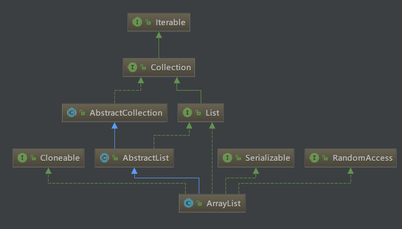

<!-- TOC -->

- [List<T> list=new ArrayList<>()引发的思考](#listt-listnew-arraylist引发的思考)
    - [多态的概念](#多态的概念)
        - [向上转型](#向上转型)
        - [向下转型](#向下转型)
    - [接口编程](#接口编程)

<!-- /TOC -->

# List<T> list=new ArrayList<>()引发的思考

## 多态的概念

多态--就是指程序中定义的引用变量所指向的具体类型和通过该引用变量发出的方法调用在编程时并不确定，而是在程序运行期间才确定，即一个引用变量倒底会指向哪个类的实例对象，该引用变量发出的方法调用到底是哪个类中实现的方法，必须在由程序运行期间才能决定。因为在程序运行时才确定具体的类，这样，不用修改源程序代码，就可以让引用变量绑定到各种不同的类实现上，从而导致该引用调用的具体方法随之改变，即不修改程序代码就可以改变程序运行时所绑定的具体代码，让程序可以选择多个运行状态，这就是多态性。

比如，比如你是一个酒神，对酒情有独钟。某日回家发现桌上有几个杯子里面都装了白酒，从外面看我们是不可能知道这是些什么酒，只有喝了之后才能够猜出来是何种酒。你一喝，这是剑南春、再喝这是五粮液、再喝这是酒鬼酒…. 在这里我们可以描述成如下：

      酒 a = 剑南春

      酒 b = 五粮液

      酒 c = 酒鬼酒

这里所表现的的就是多态。剑南春、五粮液、酒鬼酒都是酒的子类，我们只是通过酒这一个父类就能够引用不同的子类，这就是多态 —— 我们只有在运行的时候才会知道引用变量所指向的具体实例对象。

### 向上转型

在之前的例子中，通过`Wine a=new JNC();`在这里我们这样理解，这里定义了一个 Wine 类型的 a，它指向 JNC 对象实例。由于 JNC 是继承与 Wine，所以 JNC 可以自动向上转型为 Wine，所以 a 是可以指向 JNC 实例对象的。
```
public class Wine {
    public void fun1(){
        System.out.println("Wine 的Fun.....");
        fun2();
    }
    
    public void fun2(){
        System.out.println("Wine 的Fun2...");
    }
}

public class JNC extends Wine{
    /**
     * @desc 子类重载父类方法
     *        父类中不存在该方法，向上转型后，父类是不能引用该方法的
     * @param a
     * @return void
     */
    public void fun1(String a){
        System.out.println("JNC 的 Fun1...");
        fun2();
    }
    
    /**
     * 子类重写父类方法
     * 指向子类的父类引用调用fun2时，必定是调用该方法
     */
    public void fun2(){
        System.out.println("JNC 的Fun2...");
    }
}

public class Test {
    public static void main(String[] args) {
        Wine a = new JNC();
        a.fun1();
    }
}
-------------------------------------------------
Output:
Wine 的Fun.....
JNC 的Fun2...
```
指向子类的父类引用由于向上转型了，它只能访问父类中拥有的方法和属性，而对于 ***子类中存在而父类中不存在的方法(子类单独定义的方法会丢失)*** `fun1(String a)`，该引用是不能使用的，尽管是重载该方法。若子类重写了父类中的某些方法，在调用该些方法的时候，必定是使用 ***子类中定义***的这些方法（动态连接、动态调用）。

### 向下转型

与之相对应的就是向下转型。向下转型是把父类对象转为子类对象。但这里有个要注意的地方。
```
Animal a = new Cat();
Cat c = ((Cat) a);
c.eat();
//输出  我吃鱼
Dog d = ((Dog) a);
d.eat();
// 报错 ： java.lang.ClassCastException：com.chengfan.animal.Cat cannot be cast to com.chengfan.animal.Dog
Animal a1 = new Animal();
Cat c1 = ((Cat) a1);
c1.eat();
// 报错 ： java.lang.ClassCastException：com.chengfan.animal.Animal cannot be cast to com.chengfan.animal.Cat
```
因为 a 本身就是 Cat 对象，所以它理所当然的可以向下转型为 Cat，也理所当然的不能转为 Dog，你见过一条狗突然就变成一只猫这种操蛋现象？

而 a1 为 Animal 对象，它也不能被向下转型为任何子类对象。比如你去考古，发现了一个新生物，知道它是一种动物，但是你不能直接说，啊，它是猫，或者说它是狗。

***向下转型注意事项***

1. 向下转型的前提是父类对象指向的是子类对象（也就是说，在向下转型之前，它得先向上转型）
2. 向下转型只能转型为本类对象（猫是不能变成狗的）。

***
对于面向对象而言，多态分为编译时多态和运行时多态。其中编译时多态是静态的，主要是指方法的重载，它是根据参数列表的不同来区分不同的函数，通过编辑之后会变成两个不同的函数，在运行时谈不上多态。而运行时多态是动态的，它是通过动态绑定来实现的，也就是我们所说的多态性。

***在Java中，实现多态有两种方式，继承和接口。***


<div align="center">

</div>  

从图中可以看出，`ArrayList` 继承了`AbstractList`类，同时也实现了`List`接口。

在语句`List<T> list=new ArrayList<>();`中，`list`此时就是`List`这个接口的实例化对象了，它可以使用`List`接口中的方法。`ArrayList`独有的就不能用了，比如`arraylist.trimToSize()`方法就不能用。


那为什么一般都使用 `List list = new ArrayList ()` , 而不用 `ArrayList alist = new ArrayList ()` 呢?

问题就在于 `List` 有多个实现类，如 `LinkedList` 或者 `Vector` 等等，现在你用的是 ArrayList，也许哪一天你需要换成其它的实现类呢？，这时你只要改变这一行就行了：`List list = new LinkedList ()`; 其它使用了 `list` 地方的代码根本不需要改动。

假设你开始用 `ArrayList alist = new ArrayList ()`, 这下你有的改了，特别是如果你使用了 `ArrayList` 特有的方法和属性.如果没有特别需求的话，最好使用 `List list = new LinkedList ()`; , 便于程序代码的重构. 这就是面向接口编程的好处。

## 接口编程
